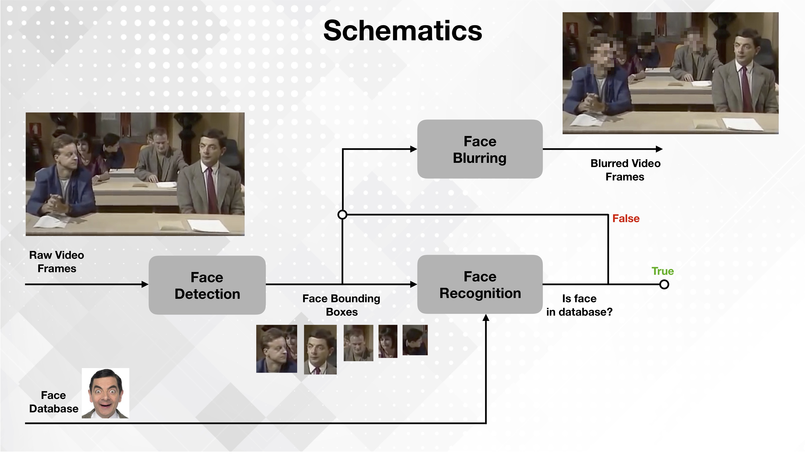
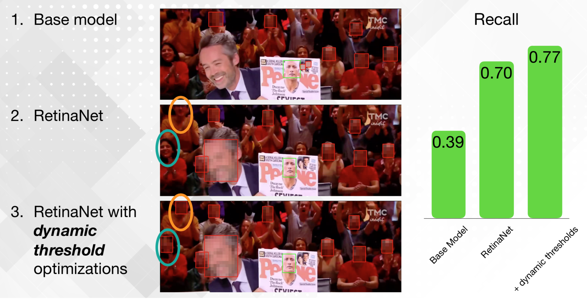

# LimeLight
This repo documents my demo project during my stint with the Insight program at Toronto. 

### What is LimeLight?
LimeLight is a deep-learning based privacy tool that *automatically* and *selectively* blurs faces in videos.

<a href="http://www.auto-anonymize.com" target="_blank">Check out LimeLight's website!</a>

### What is LimeLight Trying to Solve?
Video content creators, such as social media vloggers and news television companies, have to comply with data privacy laws like the General Data Protection Regulation (GDPR) in Europe. 

Publishing a video online requires getting consent from members of the public who appear in the video. Alternatively, their faces have to be anonymized manually. 

Both of these solutions are impractical and time-consuming.

## Installation
LimeLight was developed on Python 3.6. 

To install all related dependencies:
```
pip install -r requirements.txt
```

## Usage
To use LimeLight from the command line, enter:
```
python limelight/anonymize_vid.py <path_to_video> --known-faces-loc=<faces_directory>
```
where
- `<path_to_video>` contains the path to the video to be anonymized
- `<faces_directory>` is a directory containing `.jpg` images of faces of the subject. These faces will not be blurred.

####  Other optional arguments:
- `--dst`: Location to save processed video. Defaults to the same folder as `path_to_video`.
- `--mark-faces`: Mark detected faces with bounding boxes.

## Demo


Original YouTube source video can be found <a href="https://www.youtube.com/watch?v=zJCRSbNGtm0" target="_blank">here</a>.
 

## Implementational Details


LimeLight comprises of two main parts, Face Detection and Face Recognition, as shown in the schematic above. For this project, **the focus of my work is on improving the Face Detection aspect** using deep learning, since the Face Recognition uses a state-of-the-art face embedder and runs relatively quickly on `dlib`.

### Face Detection
A pre-trained RetinaNet model in Keras that has been re-trained to detect faces using transfer learning. The model was re-trained on the 
<a href="http://mmlab.ie.cuhk.edu.hk/projects/WIDERFace/" target="_blank">WIDER FACE dataset</a>.

### Face Recognition
Performed using a Siamese Network with FaceNet as the feature extractor / embedder. The `face_recognition` and `dlib` modules were used to implement Face Recognition. 

## Performance
Given the use case, failing to detect a face (false negative) is more undesirable than misclassifying an object as a face (false positive). A performant solution detect as many faces as possible and also run close to, if not in, real-time. 

As such, the metrics pertinent to this use case are *recall* and *processing speed*.

### Recall
The following image shows three different iterations of my face detection models and their results.


**Note**: The base model uses the <a href="https://en.wikipedia.org/wiki/Viola%E2%80%93Jones_object_detection_framework#Haar_Features" target="_blank">Viola Jones object detection framework</a>, implemented in OpenCV.

### Processing Speed
Through a series of optimizations, the processing speed of LimeLight's face detection was improved 20-folds to 5.9fps. 


The processing speed could be improved further through some optimizations described in the Future Work Section.


## Future Work
The following optimizations could be attempted to improve LimeLight — I might just try them out after the Insight program.
- A triage network — skips face detection if the subsequent frame is similar
- Network pruning
- Network quantization

## References
- WIDER FACE dataset, available at <a href="http://mmlab.ie.cuhk.edu.hk/projects/WIDERFace/" target="_blank">here</a>.
```
@inproceedings{yang2016wider,
	Author = {Yang, Shuo and Luo, Ping and Loy, Chen Change and Tang, Xiaoou},
	Booktitle = {IEEE Conference on Computer Vision and Pattern Recognition (CVPR)},
	Title = {WIDER FACE: A Face Detection Benchmark},
	Year = {2016}}
```